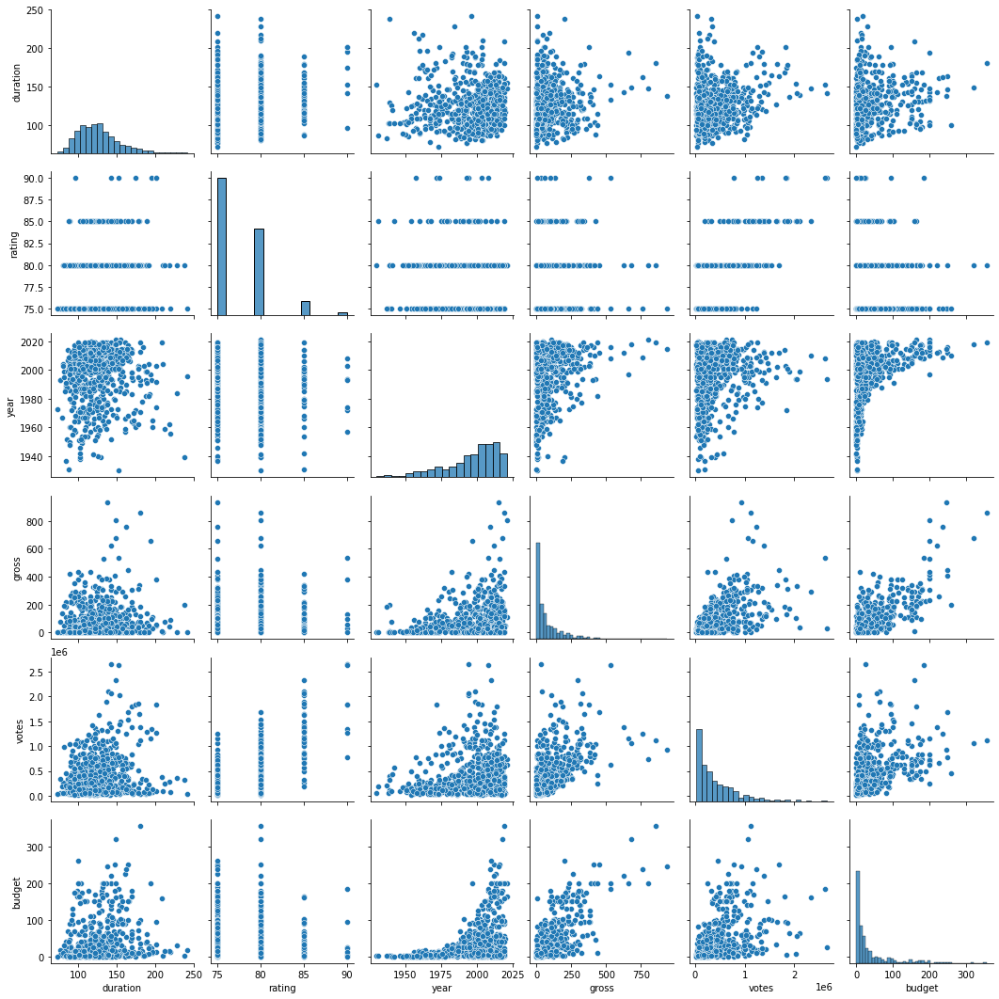

# IMDB BOX OFFICE PREDICTION

Predicting movie ratings was never this easy,
**ORRR** 
Should I say it never felt this bot-like 😎

--------------

IMDB gives rating to movies based on several criteria. We will analyze these and predict the rating of movies using Machine Learning Models.
Powered by **Jupyter**
Partner in Crime: Rishabh Kumar (......pending link.......)
Main File to Look for in the repo: [Main File with 4 Models](MainFile_4-Models.ipynb)

---------------
## Libraries Used 📚

 - NumPy – For arrays 
 -  Pandas – For DataFrames, reading csv, etc. 
 -  BeautifulSoup – For Scraping web pages 
 -  Requests – For getting requests from URLs 
 -  Multi-Threading – For Running multiple functions simultaneously in different threads 
 -  Matplotlib – For Plotting graphs for analysis purpose 
 -  Seaborn – Based on matplotlib, advanced graphs 
 -  Scikit-Learn – For various models, data encoding, metrics, etc

## Data used to Make Model 🎞️🎞️

 - Major Cast
 - Director
 - Duration
 - Year
 - Budget
 - Gross
 - Votes by Users
 - Certification

## Data Analysis - A Small Touch 📈📉

Some things we can infer from the above graph are:

 - As the time changed, the movie budget and gross increased as well. 
 -  Also, as the time changed, the number of voters also increased because of more access to internet. 
 -  Duration had no effect with years, and are randomly set, but also major movie with higher time duration were released in later part of the graph 
 -  Movie with rating higher than 9.0 weren’t affected by time.

## What we will be predicting?  🤑

Rating of the movies.
Rating will be out of 100, and on the scale of 5.
Rating is in the Range of 70 (7.0) - 95 (9.5).
Reason for such scale: Data has been taken only from Top 1000 Movies list on IMDB and after web scraping - cleaning data - we get only 661 Valid Movie data. 

## Dataset Used

Dataset made with love by me!!
Made with the help of web scraping.
Code to Web Scrapper: [IMDB top 1000 Scrapper](https://github.com/Gurneet1928/imdb_top1000_scrapper)
Cleaning of the data is in the file **Trial.ipynb** , **Linear_Regression.ipynb** and some piece in **Web_Scrapper.ipynb**
The code has been distributed all over the notebooks due to rush, hope you understand.

## Encoding Used for specific data  😁

We will be encoding the following columns:

 - Year
 - Director
 - Major Cast
 - Certification

To encode these as per requirement, we will be using **Label Encoding**
Once we encode the data, we export it into **temp_data.csv** for further use. 

## Training and Testing Data 👟👟

We split the data by general means, by using **train_test_split**, having a ratio of 0.90:0.10 (90% : 10%), 1500 random states and true shuffling.

## Models Used 

Before building the model, we will be using **Standard Scaler** on each model and also use **Pipelining** to train multiple models at once.
We use the following models:

 - Logistic Regression
 - Gradient Boosting 
 - Random Forest
 - Ridge Classifier

## Accuracy  🎯

Accuracy varied as per random splitting of data. Mainly 65% Greater for all models at major times, which is great for self-generated dataset. Sometimes it even crosses 80%, which is like a sweet cream over the cake. 

## Contributing

Really need someone to scrape some more data out of IMDB, rather than me just getting only valid 60% from 1000. We can have some more, can't we ??
Have some good ideas ? Have the knowledge to contribue to this project ? Or maybe you found a bug, glitch ? Or maybe you can help to clean this code ? Or maybe anything you want to share ? Create an Issue request or Pull Request and we can carry the talk over there !! I am always open to suggestions :)

## Future Scope

In future, we can improve the accuracy to higher rates by adding more data into dataset, use different models, and even include neural network if possible. A different encoding technique and addition of steps like PCA can also result in better output. We can also analyse the data into more different types. We might add more columns of different data types in future to improve the feasibility of the project.

## License

Distributed under the License of MIT, which provides permission to any person obtaining a copy of this software and associated documentation files (the "Software"), to deal in the Software without restriction, including without limitation the rights to use, copy, modify, merge, publish, distribute, sublicense, and/or sell copies of the Software. Check **LICENSE** file for more info.

## A Vote of Thanks

Made till here ? I would like to thank you for reading this whole(possibly) README to reach this endpoint. If you found this software helpful in any case, make sure to star it. 
(┬┬﹏┬┬)
(┬┬﹏┬┬)
